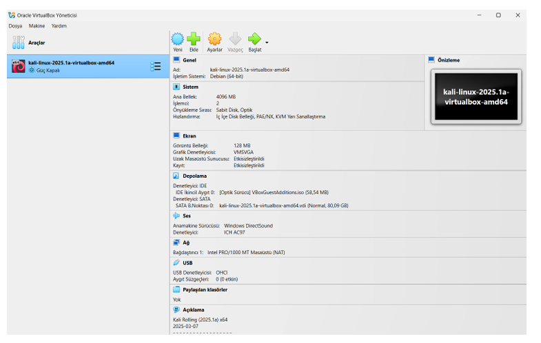

<h1 align="center">:computer::spider::closed_lock_with_key:OWASP ZAP & WebGoat: A Hands-on Web Security Lab</h1>

  
  
  

  This project focuses on web application security testing using OWASP WebGoat and OWASP ZAP tools.
  The WebGoat platform was used to analyze and exploit common web vulnerabilities such as SQL Injection, XSS, SSRF, JWT attacks, and Brute Force. 
  OWASP ZAP was utilized to automatically and manually scan these vulnerabilities, intercept HTTP requests, and analyze web traffic. 
  The project aims to demonstrate both offensive and defensive techniques for securing modern web applications in a virtual test environment.

## 🧰 Tools Used
- OWASP WebGoat
- OWASP ZAP
- Kali Linux
- Firefox DevTools

## 🔍 Explored Vulnerabilities
- SQL Injection
- Cross-Site Scripting (XSS)
- Server-Side Request Forgery (SSRF)
- JSON Web Token (JWT) flaws
- Brute Force attacks

## 📰 Full Project Documentation
📄 [Click here to view the full project documentation (PDF)](./OWASP_WebGoat_ZAP_Project_Documentation.pdf)

## 📸 Project Tools Screenshots

### :spider: 1. Kali Linux

### ⬇️ 2. OWASP WebGoat Installation

### 🏠 3. OWASP WebGoat Home Page

### 🏠 4. OWASP ZAP Home Page

### 🔍 5. OWASP ZAP Automated Scan

## 🧠 Conclusion

This project provided hands-on experience with identifying, analyzing, and exploiting common web application vulnerabilities in a controlled environment.
Using OWASP WebGoat and ZAP, we explored real-world attack vectors such as SQL Injection, Cross-Site Scripting (XSS), JWT weaknesses, and brute force attacks.
The combination of manual and automated testing demonstrated how attackers can exploit insecure applications and how developers and testers can detect and fix such flaws.
Overall, the project highlights the importance of secure coding practices and continuous security testing in web application development.
